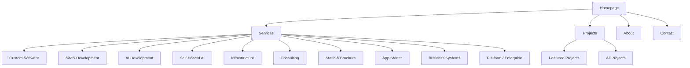

# NemesisNet

AI Infrastructure & Platform Engineering - [dev.nemesisnet.co.za](https://dev.nemesisnet.co.za)

## Badges

[](https://ci.nemesisnet.co.za/Nemesis/nemesisnet)
[](https://dev.nemesisnet.co.za)
[](https://dev.nemesisnet.co.za)
[](https://dev.nemesisnet.co.za)

## Overview

NemesisNet builds AI-powered platforms, backend systems, and automation infrastructure for real production workloads. This is the source code for our portfolio website, built with Nuxt 4 using Server-Side Rendering (SSR) and static prerendering.

## Tech Stack

- **Framework:** Nuxt 4.4.8
- **Rendering:** SSR + Static Prerendering (31 pages)
- **Styling:** Custom CSS with glassmorphic UI
- **Deployment:** Docker + Node.js (Nitro SSR server)
- **CI/CD:** Woodpecker CI
- **Contact:** Resend + Cloudflare Turnstile

## Quick Start

```bash
# Install dependencies
npm install

# Run dev server
npm run dev

# Build for production
npm run build
```

## Deployment

### Docker (Local)

```bash
# Build Docker image
wsl docker build --no-cache -t nemesisguy/nemesisnet:dev .

# Push to Docker Hub
wsl docker push nemesisguy/nemesisnet:dev
```

### CI/CD Pipeline

The site automatically deploys via Woodpecker CI when pushing to the `dev` branch:

1. **Build** - npm ci && npm run build
2. **Docker Build** - Build and tag image
3. **Docker Push** - Push to Docker Hub
4. **Deploy** - Portainer pulls and redeploys
5. **Lighthouse** - Audit deployed site
6. **Cleanup** - Remove old local images

See [CI Pipeline Documentation](./docs/CI_PIPELINE.md) for details.

## Site Architecture



For detailed architecture diagrams and user flows, see [Site Architecture Documentation](./docs/SITE_ARCHITECTURE.md).

## Documentation

Detailed documentation is available in the `/docs` directory:

| Document | Description |
|----------|-------------|
| [SITE_ARCHITECTURE.md](./docs/SITE_ARCHITECTURE.md) | Navigation flows, diagrams, ecosystem |
| [USER_FLOW.md](./docs/USER_FLOW.md) | User journeys and conversion paths |
| [LIGHTHOUSE_TESTING.md](./docs/LIGHTHOUSE_TESTING.md) | Testing config, thresholds, debugging |
| [CI_PIPELINE.md](./docs/CI_PIPELINE.md) | Pipeline steps, troubleshooting |

## Lighthouse Scores

Target scores: Performance >90, Accessibility >90, Best Practices >90, SEO >90

Run audits with `node lighthouse-audit.js` (single page) or `node lighthouse-full-audit.js` (full site).

See [Lighthouse Testing](./docs/LIGHTHOUSE_TESTING.md) for details.

## Image Optimization

```bash
# Optimize a project's hero images
./optimize-images.sh <project-folder>

# Example
./optimize-images.sh codecritical-saas
```

## Pages (31 Total)

- Homepage (`/`)
- Projects (`/projects`) + 14 project pages
- Services (`/services`) + 6 service pages + 4 tier detail pages
- About (`/about`)
- Contact (`/contact`)
- Legal (`/legal/privacy`, `/legal/terms`, `/legal/refund`)

## External Sites

| Site | URL |
|------|-----|
| Production | nemesisnet.co.za |
| Dev | dev.nemesisnet.co.za |
| Blog | blog.nemesisnet.co.za |
| Brand Guide | brand.nemesisnet.co.za |
| Scope Form | scope.nemesisnet.co.za |
| CodeCritical Demo | codecritical.nemesisnet.co.za |
| Since Demo | since.nemesisnet.co.za |
| ForkMyFolio | forkmyfolio.nemesisnet.co.za |
| OnTheGoRentals | otgr.nemesisnet.co.za |
| NK Assessments | nkassessments.nemesisnet.co.za |

## License

Proprietary - All rights reserved

## Contact

- Email: admin@nemesisnet.co.za
- GitHub: https://github.com/NemesisGuy
- LinkedIn: https://linkedin.com/in/peter-buckingham