# NemesisNet Portfolio

AI Infrastructure & Platform Engineering - [dev.nemesisnet.co.za](https://dev.nemesisnet.co.za)

## About

NemesisNet builds AI-powered platforms, backend systems, and automation infrastructure for real production workloads. This is the source code for our portfolio website, built with Nuxt 4 using Server-Side Rendering (SSR) and static prerendering.

## Tech Stack

- **Framework:** Nuxt 4.4.4
- **Rendering:** SSR + Static Prerendering (22 pages)
- **Styling:** Custom CSS with glassmorphic UI
- **Deployment:** Docker + nginx:1.27-alpine

## Site Map

```mermaid
graph TD
    Home[Home] --> Projects
    Home --> Services
    Home --> About
    
    Projects --> KokoroTTS[Kokoro TTS]
    Projects --> WordPressMCP[WordPress MCP]
    Projects --> NKAssessments[NK Assessments]
    Projects --> CodeCritical[CodeCritical CLI]
    Projects --> CodeCriticalSaaS[CodeCritical SaaS]
    Projects --> VibeType[VibeType]
    Projects --> ForkMyFolio[ForkMyFolio]
    Projects --> OnTheGoRentals[OnTheGoRentals]
    Projects --> BoredRoomCafe[Bored Room Cafe]
    Projects --> VoxNemesis[VoxNemesis Supertonic]
    Projects --> Since[Since]
    
    Services --> CustomSoftware[Custom Software]
    Services --> SaaSDev[SaaS Development]
    Services --> Infrastructure[Infrastructure & DevOps]
    Services --> Consulting[Consulting & Architecture]
    
    Home --> Legal
    Legal --> Privacy[Privacy Policy]
    Legal --> Terms[Terms of Service]
    Legal --> Refund[Refund Policy]
```



## Pages (22 Total)

| Route | Description |
|-------|-------------|
| `/` | Homepage - hero, services, projects, testimonials |
| `/projects` | All projects grid |
| `/projects/kokoro-tts` | Kokoro TTS Service |
| `/projects/wordpress-mcp` | WordPress MCP Server |
| `/projects/nk-assessments` | NK Assessments |
| `/projects/codecritical` | CodeCritical CLI |
| `/projects/codecritical-saas` | CodeCritical SaaS |
| `/projects/vibetype` | VibeType |
| `/projects/forkmyfolio` | ForkMyFolio |
| `/projects/onthegorentals` | OnTheGoRentals |
| `/projects/bored-room-cafe` | Bored Room Cafe |
| `/projects/voxnemesis-supertonic` | VoxNemesis Supertonic |
| `/projects/since` | Since |
| `/services` | Services overview |
| `/services/custom-software` | Custom Software Development |
| `/services/saas-dev` | SaaS Development |
| `/services/infrastructure` | Infrastructure & DevOps |
| `/services/consulting` | Consulting & Architecture |
| `/about` | About page |
| `/legal/privacy` | Privacy Policy |
| `/legal/terms` | Terms of Service |
| `/legal/refund` | Refund Policy |

## Development

```bash
# Install dependencies
npm install

# Run dev server
npm run dev

# Build for production
npm run build
```

## Docker Deployment

```bash
# Build Docker image
wsl docker build --no-cache -t nemesisguy/nemesisnet:dev .

# Push to Docker Hub
wsl docker push nemesisguy/nemesisnet:dev
```

## Image Optimization

```bash
# Optimize a project's hero images
./optimize-images.sh <project-folder>

# Example
./optimize-images.sh codecritical-saas
```

## Lighthouse Scores

| Category | Score |
|----------|-------|
| Performance | 91/100 |
| Accessibility | 98/100 |
| Best Practices | 81/100 |
| SEO | 99/100 |

## License

Proprietary - All rights reserved

## Contact

- Email: admin@nemesisnet.co.za
- GitHub: https://github.com/NemesisGuy