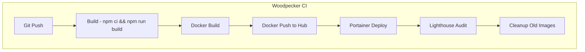

# CI Pipeline Documentation

This document details the Woodpecker CI pipeline configuration, deployment process, and troubleshooting.

## Pipeline Overview



## Pipeline Steps

### 1. Build
- **Image**: node:22
- **Commands**:
  - `npm ci` - Install dependencies
  - `npm run build` - Production build with Nuxt
- **Conditions**: Push, tag, manual

### 2. Docker Build
- **Image**: docker:27
- **Commands**:
  - Login to Docker Hub
  - Build with tags: `dev` and `${CI_COMMIT_SHA}`
- **Secrets**: DOCKER_USERNAME, DOCKER_PASSWORD
- **Volumes**: Docker socket

### 3. Docker Push
- **Image**: docker:27
- **Commands**:
  - Login to Docker Hub
  - Push `nemesisguy/nemesisnet:dev`
  - Push `nemesisguy/nemesisnet:${CI_COMMIT_SHA}`
- **Conditions**: Push, tag, manual, branch: dev

### 4. Deploy
- **Image**: curlimages/curl
- **Commands**:
  - PUT to Portainer API to update stack
  - `pullImage: true` to fetch latest
  - `prune: true` to recreate containers
  - `forceRecreate: true` to ensure new image used
- **Secrets**: PORTAINER_API_KEY
- **Conditions**: Push, tag, manual, branch: dev

### 5. Lighthouse Audit
- **Image**: node:22
- **Commands**:
  - Install Chrome dependencies
  - Run npm ci
  - Execute lighthouse-audit.js
- **Conditions**: Push, tag, manual, branch: dev
- **Output**: Lighthouse report JSON

### 6. Cleanup
- **Image**: docker:27
- **Commands**:
  - Remove old local images
  - Keep only latest 2 SHA-tagged images
- **Conditions**: Push, tag, manual, branch: dev

## Environment Variables

| Variable | Description | Source |
|----------|-------------|--------|
| CI_COMMIT_SHA | Git commit SHA | Auto |
| CI_COMMIT_BRANCH | Branch name | Auto |
| CI_EVENT | Push/tag/manual | Auto |

## Secrets Configuration

### Docker Hub
- **Name**: DOCKER_USERNAME, DOCKER_PASSWORD
- **Level**: Repository or global
- **Usage**: Login to Docker Hub for push

### Portainer
- **Name**: portainer_api_key
- **Level**: Repository
- **Usage**: API authentication for deploy

## Triggers

### Push to Dev Branch
```yaml
when:
  event: [push, tag, manual]
  branch: dev
```

### Manual Trigger
- Use Woodpecker "Run Pipeline" button
- Select branch and event type

## Deployment Flow

### Local Development
```bash
npm run dev
```

### CI Deployment
1. Push to dev branch
2. Woodpecker triggers pipeline
3. Build runs in node:22 container
4. Docker image built and pushed
5. Portainer pulls and redeploys
6. Lighthouse tests deployed version

### Manual Deploy
```bash
git commit --allow-empty -m "trigger deploy"
git push origin dev
```

## Troubleshooting

### Build Failures

**npm ci fails**
- Check package.json for valid dependencies
- Verify node version compatibility (node:22)

**Nuxt build fails**
- Check for TypeScript errors
- Verify all imports resolve

### Docker Failures

**Docker login fails**
- Verify secrets are set correctly
- Check DOCKER_USERNAME and DOCKER_PASSWORD
- Ensure repo has permission for the registry

**Docker build fails**
- Check Dockerfile syntax
- Verify build context is correct
- Ensure sufficient disk space

### Deploy Failures

**Portainer API returns 400**
- Verify stack ID is correct (82)
- Check endpointId is correct (3)
- Ensure JSON payload is valid

**Container not updating**
- Ensure pullImage: true
- Check forceRecreate: true
- Verify prune: true

### Lighthouse Failures

**Chrome dependencies missing**
- Add apt-get install for libnss3, libnspr4, etc.

**Puppeteer fails to launch**
- Ensure --no-sandbox flag set
- Check Chrome dependencies installed

## Monitoring

### Pipeline Logs
Access via Woodpecker UI:
- Pipeline execution logs
- Step-by-step output
- Error messages

### Artifacts
- Lighthouse JSON reports
- Build logs

### External Monitoring
- Portainer for container status
- Nginx logs for request logs

## Rollback Procedure

### Quick Rollback (Previous Image)
```bash
# Find previous SHA
docker images nemesisguy/nemesisnet --format "{{.Tag}}" | grep -v dev

# Pull and redeploy
docker pull nemesisguy/nemesisnet:<previous-sha>
# Use Portainer or docker run to redeploy
```

### Full Rollback (Git)
```bash
# Revert to previous commit
git revert HEAD
git push origin dev
```

## Adding New Pipeline Steps

1. Edit `.woodpecker.yml`
2. Add step with required configuration
3. Test locally before pushing

Example:
```yaml
new-step:
  image: node:22
  commands:
    - npm ci
    - npm run new-task
  when:
    event: [push, tag, manual]
    branch: dev
```

## Security Considerations

- Store secrets in Woodpecker, not in code
- Use `from_secret` for sensitive values
- Limit secret access to required repos
- Rotate credentials periodically

## Performance

- Pipeline typically completes in 5-10 minutes
- Build step: ~2-3 minutes
- Docker build: ~1-2 minutes
- Deploy: ~30 seconds
- Lighthouse: ~2-3 minutes

## Links

- [Woodpecker CI Docs](https://woodpecker-ci.org/docs)
- [Portainer API Docs](https://documentation.portainer.io/)
- [Lighthouse CI](https://github.com/GoogleChrome/lighthouse-ci)