# CI Pipeline Documentation

This document details the Woodpecker CI pipeline configuration, deployment process, and troubleshooting.

## Pipeline Overview

The CI has two parallel pipelines: **dev** and **prod**, triggered by pushes to their respective branches.

```mermaid
flowchart TB
    subgraph "Dev Pipeline"
        DEV_PUSH[Push to dev]
        DEV_LINT[Lint]
        DEV_BUILD[Build]
        DEV_DOCKER[Docker Build & Push]
        DEV_DEPLOY[Deploy to Dev]
        DEV_CLEAN[Cleanup]

        DEV_PUSH --> DEV_LINT --> DEV_BUILD --> DEV_DOCKER --> DEV_DEPLOY --> DEV_CLEAN
    end

    subgraph "Prod Pipeline"
        PROD_PUSH[Push to master]
        PROD_LINT[Lint]
        PROD_BUILD[Build]
        PROD_DOCKER[Docker Build & Push]
        PROD_DEPLOY[Deploy to Prod]
        PROD_LH[Lighthouse Audit]
        PROD_CLEAN[Cleanup]

        PROD_PUSH --> PROD_LINT --> PROD_BUILD --> PROD_DOCKER --> PROD_DEPLOY --> PROD_LH --> PROD_CLEAN
    end
```



## Pipeline Steps

### Shared Steps (Both Dev & Prod)

#### 1. Lint
- **Image**: node:22
- **Commands**:
  - `npm ci` - Install dependencies
  - `npm run lint` - Run ESLint
- **Conditions**: Push, tag, manual

#### 2. Build
- **Image**: node:22
- **Commands**:
  - `npm run build` - Production build with Nuxt
  - Dev: `NUXT_PUBLIC_NO_INDEX=true npm run build`
  - Prod: `npm run build` (no NO_INDEX)
- **Conditions**: Push, tag, manual

#### 3. Docker Build & Push
- **Image**: docker:27
- **Commands**:
  - Login to Docker Hub
  - Build with tags: `dev` or `prod` and `${CI_COMMIT_SHA}`
  - Push `nemesisguy/nemesisnet:<tag>`
- **Secrets**: DOCKER_USERNAME, DOCKER_PASSWORD
- **Volumes**: Docker socket

#### 4. Deploy
- **Image**: curlimages/curl
- **Commands**:
  - PUT to Portainer API to update stack
  - `pullImage: true` to fetch latest
  - `prune: true` to recreate containers
  - `forceRecreate: true` to ensure new image used
- **Secrets**: PORTAINER_API_KEY
- **Portainer Stack IDs**: Dev = 82, Prod = 32

### Dev-Only Steps

#### Cleanup
- **Image**: docker:27
- **Commands**:
  - Remove old local images
  - Keep only latest 2 SHA-tagged images

### Prod-Only Steps

#### 5. Lighthouse Audit
- **Image**: node:22
- **Commands**:
  - Install Chrome dependencies
  - `npm ci`
  - `node lighthouse-audit.js`
- **Conditions**: Push, tag, manual, branch: master
- **Audits**: accessibility, best-practices, seo (no performance — CI latency skews it)
- **Output**: Lighthouse report JSON

#### 6. Cleanup
- Remove old local images

## Environment Variables

| Variable | Description | Source |
|----------|-------------|--------|
| CI_COMMIT_SHA | Git commit SHA | Auto |
| CI_COMMIT_BRANCH | Branch name | Auto |
| CI_EVENT | Push/tag/manual | Auto |

## Secrets Configuration

### Docker Hub
- **Name**: DOCKER_USERNAME, DOCKER_PASSWORD
- **Level**: Repository or global
- **Usage**: Login to Docker Hub for push

### Portainer
- **Name**: PORTAINER_API_KEY
- **Level**: Repository
- **Usage**: API authentication for deploy

## Deployment Flow

### Local Development
```bash
npm run dev
```

### CI Deployment (Dev)
1. Push to dev branch
2. Woodpecker triggers pipeline
3. Lint → Build → Docker Build & Push → Deploy to dev stack (82)

### CI Deployment (Prod)
1. Push to master branch
2. Woodpecker triggers pipeline
3. Lint → Build → Docker Build & Push → Deploy to prod stack (32) → Lighthouse audit

### Manual Deploy
```bash
git commit --allow-empty -m "trigger deploy"
git push origin dev
```

## Troubleshooting

### Build Failures

**npm ci fails**
- Check package.json for valid dependencies
- Verify node version compatibility (node:22)

**Nuxt build fails**
- Check for TypeScript errors
- Verify all imports resolve

### Docker Failures

**Docker login fails**
- Verify secrets are set correctly
- Check DOCKER_USERNAME and DOCKER_PASSWORD

**Docker build fails**
- Check Dockerfile syntax
- Verify build context is correct
- Ensure sufficient disk space

### Deploy Failures

**Portainer API returns 400**
- Verify stack ID is correct (82 for dev, 32 for prod)
- Check endpointId is correct (3)
- Ensure JSON payload is valid

**Container not updating**
- Ensure pullImage: true
- Check forceRecreate: true
- Verify prune: true

### Lighthouse Failures

**Chrome dependencies missing**
- Add apt-get install for libnss3, libnspr4, etc.

**Puppeteer fails to launch**
- Ensure --no-sandbox flag set
- Check Chrome dependencies installed

## Monitoring

### Pipeline Logs
Access via Woodpecker UI:
- Pipeline execution logs
- Step-by-step output
- Error messages

### Artifacts
- Lighthouse JSON reports
- Build logs

### External Monitoring
- Portainer for container status
- Nginx logs for request logs

## Rollback Procedure

### Quick Rollback (Previous Image)
```bash
# Find previous SHA
docker images nemesisguy/nemesisnet --format "{{.Tag}}" | grep -v dev

# Pull and redeploy
docker pull nemesisguy/nemesisnet:<previous-sha>
# Use Portainer or docker run to redeploy
```

### Full Rollback (Git)
```bash
# Revert to previous commit
git revert HEAD
git push origin dev
```

## Security Considerations

- Store secrets in Woodpecker, not in code
- Use `from_secret` for sensitive values
- Limit secret access to required repos
- Rotate credentials periodically
