# Site Architecture Documentation

## Overview

This document provides detailed architectural diagrams and documentation for the NemesisNet portfolio site, including navigation flows, link relationships, and ecosystem integration.

## Domain Structure

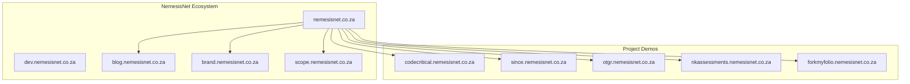

## Full Site Navigation Flow

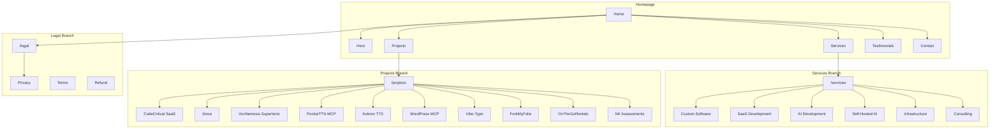

## Internal/External Link Relationships

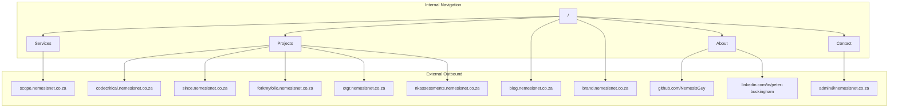

## CTA Routing Paths

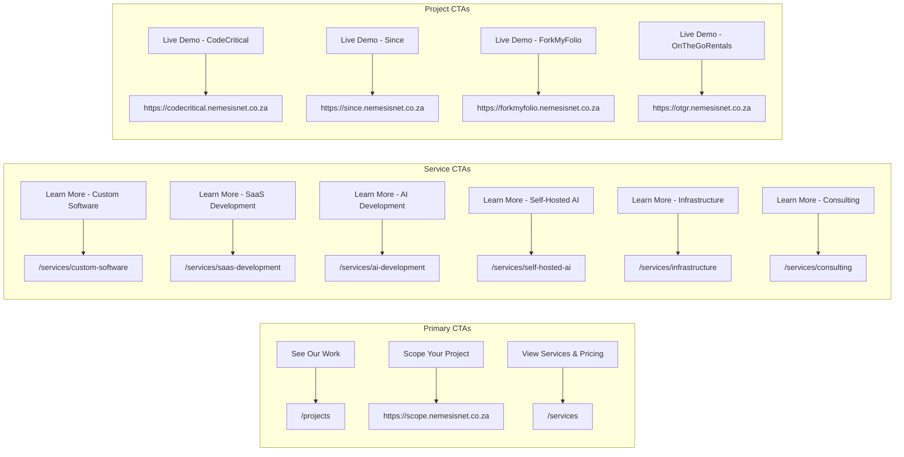

## Blog Integration Flow

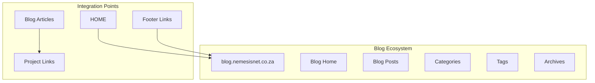

## Contact Funnel

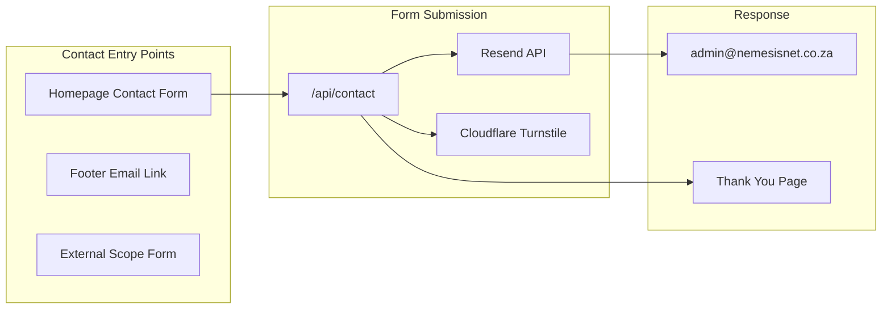

## Mobile Navigation Structure

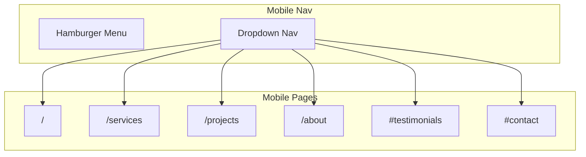

## User Journey Maps

### Landing to Project Demo Journey

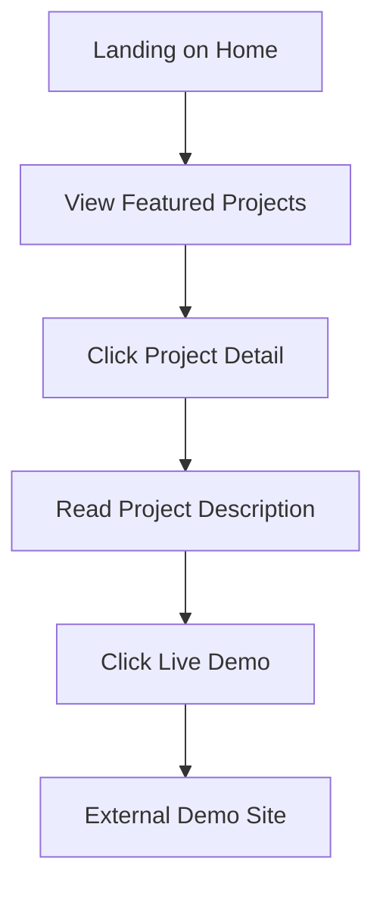

### Landing to Contact Journey

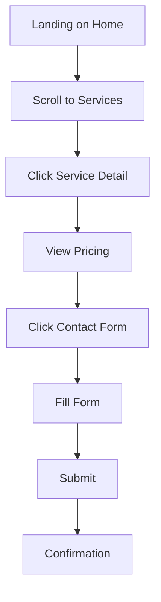

### Landing to Blog Journey

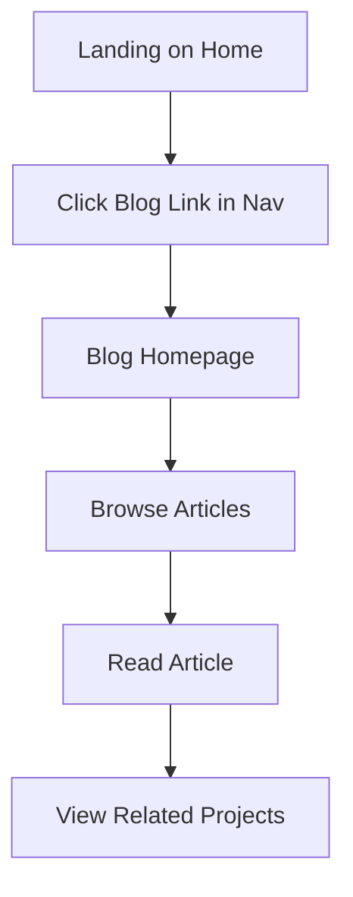

## Deployment Architecture

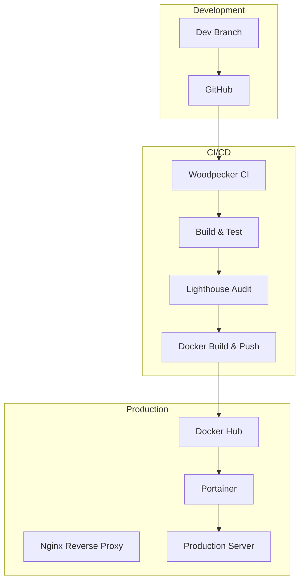

## Technology Stack

| Component | Technology | Version |
|-----------|------------|---------|
| Framework | Nuxt | 4.4.4 |
| Runtime | Node.js | 22 |
| Styling | Custom CSS | - |
| Deployment | Docker + nginx | 1.27-alpine |
| CI/CD | Woodpecker | - |
| Contact | Resend + Turnstile | - |
| Hosting | Self-hosted VPS | - |

## Performance Budgets

| Metric | Target |
|--------|--------|
| First Contentful Paint | < 2s |
| Largest Contentful Paint | < 2.5s |
| Cumulative Layout Shift | < 0.1 |
| Total Blocking Time | < 200ms |
| Speed Index | < 3s |
| Time to Interactive | < 3.5s |

## Security Configuration

- CSP headers via Nitro config
- Cloudflare Turnstile on contact form
- Resend for email delivery
- No sensitive data in client bundle