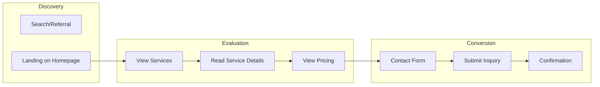
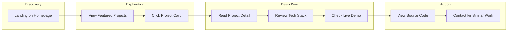
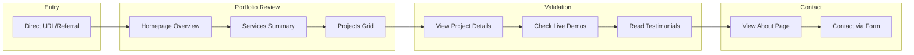
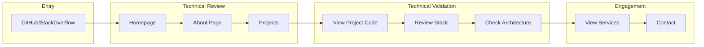

# User Flow Documentation

This document outlines the detailed user flows and interactions within the NemesisNet portfolio site.

## Primary User Journeys

### 1. Visitor → Service Inquiry



**Steps:**
1. User lands on homepage via search or referral
2. Reviews hero message and value proposition
3. Explores core services section
4. Clicks specific service for details
5. Browses pricing tiers — clicks tier cards for detailed breakdowns (included features, timelines, real examples)
6. Fills contact form or accesses scope.nemesisnet.co.za

### 2. Visitor → Project Showcase



**Steps:**
1. User lands on homepage
2. Views featured projects in homepage grid
3. Clicks project detail page
4. Reviews project description, features, and tech stack
5. Clicks live demo (external site) if available
6. Optionally views source code on GitHub

### 3. Recruiter/Client → Portfolio Review



**Steps:**
1. Recruiter or potential client lands on site
2. Reviews homepage for professional presentation
3. Explores services to understand offerings
4. Reviews projects to validate work quality
5. Reads testimonials for social proof
6. Views about page for personal connection
7. Initiates contact for opportunities

### 4. Developer → Technical Deep Dive



**Steps:**
1. Developer finds NemesisNet via GitHub or other channels
2. Reviews portfolio for technical competence
3. Explores projects with interesting tech stacks
4. Examines source code on GitHub
5. Reviews about page for technical background
6. Explores services for potential collaboration

## Conversion Paths

### Path A: Contact Form → Email

```
Homepage → Services → Contact Section → Fill Form → Submit → Admin Email
```

### Path B: Scope Form → External

```
Homepage → CTA (Scope Your Project) → scope.nemesisnet.co.za → External Form
```

### Path C: Demo → External

```
Homepage → Projects → Project Detail → Live Demo → External Site
```

## Key Touchpoints

### Homepage Touchpoints
- Hero headline with value proposition
- Service cards with learn more links
- Featured projects with live demos
- Testimonials for social proof
- Contact form for direct inquiry

### Project Detail Touchpoints
- Project description and features
- Technology stack highlights
- Live demo link (external)
- Source code link (if applicable)
- Related project suggestions

### Service Detail Touchpoints
- Service description
- Pricing tiers (4 complexity-based tiers: Static & Brochure, App Starter, Business Systems, Platform / Enterprise)
- Tier detail pages with included/excluded features, timelines, and real examples
- Related projects
- CTA to contact

## User Segment Flows

### Segment A: Business Owner Seeking Development
- Lands on site → Explores services → Views projects → Checks testimonials → Contacts via form

### Segment B: Technical Lead Seeking Contractor
- Lands on site → Reviews projects → Checks code quality → Reviews about → Contacts

### Segment C: Recruiter
- Lands on site → Reviews homepage → Checks projects → Reviews about → Uses contact info

### Segment D: Developer Exploring Work
- Lands on site → Reviews projects → Checks GitHub → Reads blog → Views about

## Exit Points

| Exit Point | Destination | Purpose |
|------------|-------------|---------|
| Live Demo Link | External demo site | View working product |
| GitHub Link | github.com/NemesisGuy | View source code |
| Blog Link | blog.nemesisnet.co.za | Read technical content |
| Brand Guide | brand.nemesisnet.co.za | View brand assets |
| Scope Form | scope.nemesisnet.co.za | Project scoping |
| LinkedIn | linkedin.com/in/peter-buckingham | Professional profile |
| Email | admin@nemesisnet.co.za | Direct contact |

## Analytics Events to Track

1. **Page Views**
   - Homepage
   - Service pages
   - Project detail pages

2. **Clicks**
   - Live demo links (external)
   - GitHub links
   - CTA buttons

3. **Forms**
   - Contact form submissions
   - Scope form submissions

4. **Engagement**
   - Time on page
   - Scroll depth
   - Return visits