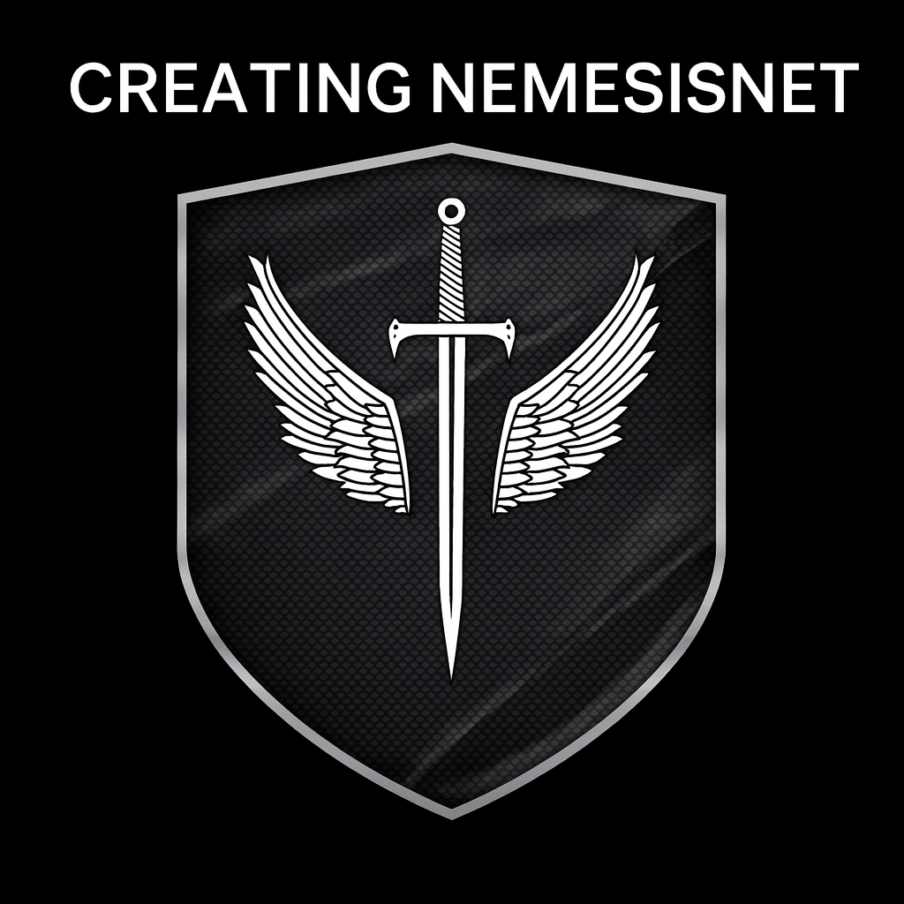

# NemesisNet — Project Overview for AI Agent

## Purpose

NemesisNet is the **central landing page and hub** for the entire NemesisNet ecosystem. It is **not a personal portfolio**; your personal portfolio is hosted separately at [ForkMyFolio](https://forkmyfolio.com). NemesisNet serves as the **gateway to all projects, tools, experiments, and content** under the Nemesis brand.

The primary goal of this site is to provide a **high-level overview** of the projects and initiatives, linking each project to its **dedicated blog post or detailed page** for more in-depth information.

---

## Key Objectives

1. **Brand Hub**
   - Establish NemesisNet as a recognizable brand for all technical projects and initiatives.
   - Serve as the authoritative entry point for all things Nemesis-related.

2. **Project & Tool Overview**
   - Display each project or tool with a **short description**.
   - Include a **link/button** to the corresponding blog post or documentation for details.
   - Keep the landing page **light, navigable, and easy to scan**.

3. **Content Integration**
   - Each project listed on NemesisNet **links to a detailed blog post**, which contains the full explanation, tutorials, demos, and technical insights.
   - The landing page itself is **high-level**, while the blog houses the **in-depth content**.

4. **Centralization & Scalability**
   - All new projects, tools, and experiments can be added as **new cards or sections**, linking to their respective blog posts.
   - Maintains a **single authoritative hub** for all NemesisNet activities.

5. **Differentiation from Personal Portfolio**
   - NemesisNet is **brand-centric**, focusing on projects, tools, and ecosystem.
   - Your personal portfolio and career-focused content is hosted separately at ForkMyFolio.

---

## Site Structure

1. **Hero / Overview Section**
   - Introduces NemesisNet, the brand, and its mission.

   

2. **Projects / Tools Grid**
   - Cards or sections for each project:
     - Project name
     - Short one-line description
     - Link to full blog post / documentation

3. **Links to Blog**
   - All detailed content resides in blog posts.
   - Visitors navigate from the high-level overview to the blog for deeper insights.

4. **Future Growth**
   - Easily add new projects or tools with links to blog posts.
   - Maintain a **clean, simple landing page** while the ecosystem grows.

---

## Key Takeaways for AI Agent

- Treat **NemesisNet as the central hub / landing page**.
- **Do not treat it as a personal portfolio** — that content lives at ForkMyFolio.
- Each project on NemesisNet should **link to its dedicated blog post** for full details.
- Focus on high-level clarity, **branding, and project navigation**, not personal achievements.
- Use the blog content as the **source of detailed information** for each project or tool.

---

**Summary Statement:**  
NemesisNet is a **gateway and hub** for the Nemesis brand, projects, and tools. It provides a **centralized, high-level overview**, linking each project to the **blog for in-depth content**. It is **distinct from the personal portfolio**, which resides at ForkMyFolio.

# NemesisNet — Central Hub Overview

## Project Name
**NemesisNet**

## URL / Slug
[https://nemesisnet.co.za/nemesisnet-overview](https://nemesisnet.co.za/nemesisnet-overview)

## Purpose
NemesisNet is the **central landing page and brand hub** for all projects, tools, and experiments in the Nemesis ecosystem. It is **not a personal portfolio** — personal career content is hosted at [ForkMyFolio](https://forkmyfolio.com).  

The site serves as a **high-level gateway**, orienting visitors, AI agents, and LLMs to the right projects and blog posts. Each project listed on NemesisNet links to a **dedicated blog post** or repository for in-depth content, tutorials, demos, and architecture notes.

## Key Objectives
1. **Brand Hub**
   - Establish NemesisNet as the authoritative front door for the entire ecosystem.
   - Maintain a consistent brand identity across all projects and subdomains.

2. **Project Overview**
   - Provide concise cards for each project: name, short description, and link to blog or source code.
   - Keep the landing page fast, navigable, and easy to scan.

3. **Content Linking**
   - Each project card points to a detailed blog entry or repository where the full information lives.
   - Blog posts contain tutorials, technical write-ups, and demo links.

4. **Automation & Maintenance**
   - Powered by a WordPress MCP Server that allows agents to create or update posts in HTML without manual UI interaction.
   - Ensures the landing page and blog are always up-to-date and consistent.

5. **Future Growth**
   - New projects or tools can easily be added as cards linked to blog posts.
   - NemesisNet remains a lean, authoritative, and expandable gateway as the ecosystem grows.

## Important Notes
- **Distinct from personal portfolio:** ForkMyFolio handles personal career and portfolio content.
- **Landing page = hub; blog = detailed content.** Never conflate the two.
- **AI / agent-friendly:** Metadata, structured content, and consistent URLs ensure AI agents can navigate, reference, and update projects reliably.

## Links
- NemesisNet hub: [https://nemesisnet.co.za](https://nemesisnet.co.za)  
9
- Docker image: [https://hub.docker.com/r/nemesisguy/nemesisnet](https://hub.docker.com/r/nemesisguy/nemesisnet)  
- Personal portfolio (ForkMyFolio): [https://forkmyfolio.com](https://forkmyfolio.com)

https://forkmyfolio.nemesisnet.co.za/nemesis

## Summary
NemesisNet is the **brand-first central hub** and high-level gateway for the Nemesis ecosystem. It provides a clean, navigable overview of projects, links to detailed content on the blog or repositories, and is automated for easy maintenance by AI agents. This ensures the brand, projects, and tools remain authoritative, consistent, and scalable over time.
