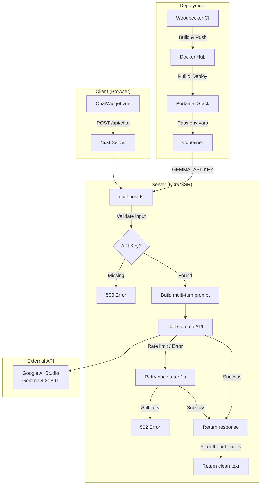
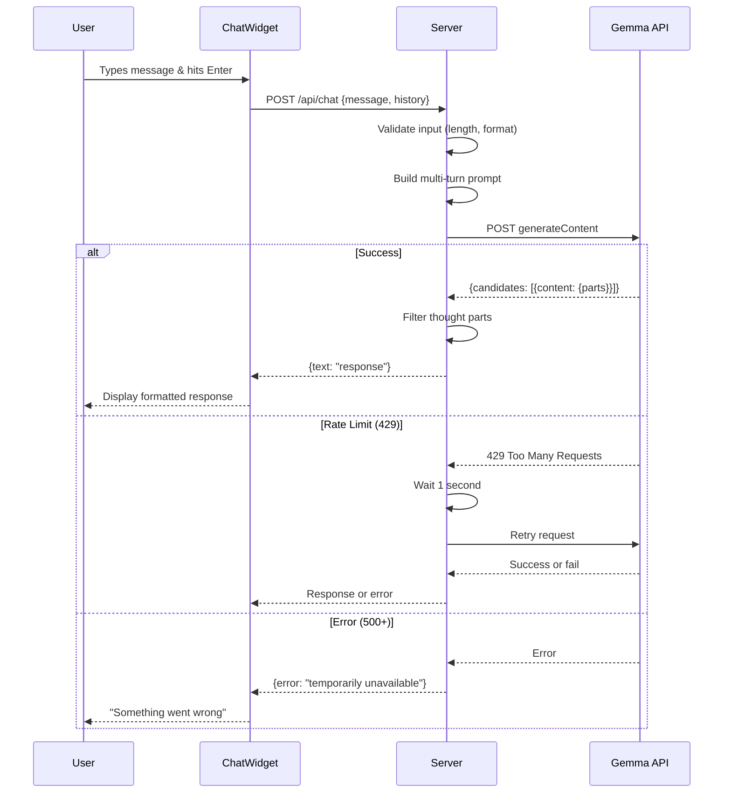
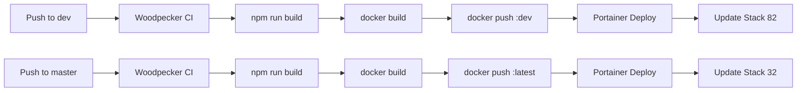

# NemesisBot Chat Widget — Architecture & Troubleshooting

## Overview

NemesisBot is an AI-powered chat widget for nemesisnet.co.za, powered by Google's Gemma 4 31B API. It provides visitors with information about NemesisNet's services, projects, and pricing.

## Architecture



## Request Flow



## Multi-Turn Prompt Format

Gemma 4 does **not** support `system_instruction` field. We use multi-turn format:

```
User: [System Prompt]
Model: "Understood. I am NemesisBot..."
User: [Previous message 1]
Model: [Previous response 1]
User: [Current message]
```

## Issues Encountered & Solutions

### 1. Mobile Close Button Not Visible (BUG-001)

**Problem:** Chat panel covered by nav bar on mobile (z-index conflict).

**Root Cause:** Nav had `z-index: 10000`, chat widget had `z-index: 9999`. Panel started at `top: 0` behind nav.

**Solution:**
- Increased chat widget z-index to `10001`
- Set mobile panel `top: 60px` to sit below nav

### 2. Links Not Clickable (BUG-002)

**Problem:** URLs in bot responses rendered as plain text, not clickable links.

**Root Cause:** `formatMessage()` only handled `**bold**`, `*italic*`, and `` `code` `` — no URL detection.

**Solution:**
- Added URL regex: `/(https?:\/\/[^\s<]+)/g`
- Converts to `<a href="$1" target="_blank">$1</a>`
- Added link styling for both themes

### 3. Bot Had No Blog Knowledge (BUG-003)

**Problem:** Bot didn't know about blog.nemesisnet.co.za.

**Root Cause:** System prompt contained no mention of the blog.

**Solution:**
- Added `## BLOG` section to system prompt
- Instructed bot to always include full URLs

### 4. Intermittent 502 Errors (BUG-004)

**Problem:** Chat sometimes returned "Something went wrong" errors.

**Root Causes:**
- Google AI Studio free tier rate limits (15 RPM)
- API key not reaching container (env var mismatch)
- Occasional Gemma API instability

**Solutions:**
- Added retry logic (1 retry after 1s delay)
- Server checks `GEMMA_API_KEY`, `NUXT_GEMMA_API_KEY`, and `config.gemmaApiKey`
- Debug logging to identify key source

### 5. Jittery Scrolling

**Problem:** Site jittered when scrolling.

**Root Cause:** `background-attachment: fixed` on both `html` and `body` causes repaint issues.

**Solution:** Removed `background-attachment: fixed` from `body`, kept on `html` only.

### 6. CSS MIME Type Errors

**Problem:** CSS files not loading on prod (MIME type empty).

**Root Cause:** Likely Cloudflare caching or Nitro static file serving issue.

**Status:** Intermittent — dev loads fine, prod sometimes fails.

## Environment Variables

| Variable | Source | Purpose |
|----------|--------|---------|
| `GEMMA_API_KEY` | Woodpecker Secret | Google AI Studio API key |
| `NUXT_GEMMA_API_KEY` | Nuxt Runtime Config | Fallback env var name |
| `RESEND_API_KEY` | Woodpecker Secret | Email service |
| `TURNSTILE_SITE_KEY` | Woodpecker Secret | Cloudflare Turnstile |
| `TURNSTILE_SECRET_KEY` | Woodpecker Secret | Cloudflare Turnstile |

## Deployment Pipeline



## Rate Limits (Google AI Studio Free Tier)

- **15 requests per minute** (RPM)
- **1,500 requests per day** (RPD)
- **1 million tokens per minute** (TPM)
- **32,000 tokens per request** (max output)

If limits are hit, consider:
1. Creating a second API key as fallback
2. Upgrading to paid tier
3. Implementing client-side rate limiting
